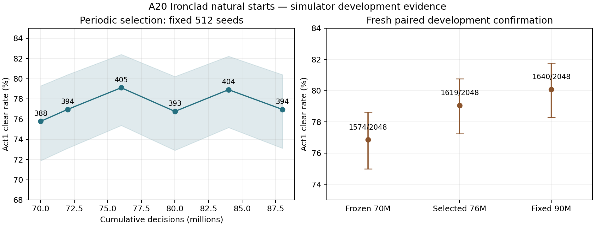

# Win 90M 结案：2026-10-05

**70M→90M 本次预算延续达到预注册开发成功判据。** 正常战士 A20 Act1 开局、同一运行环境与同一批 2,048 个新开发确认种子，固定 90M 终点比冻结 70M 多通关 66 局，提升 **3.22pp**，精确双侧 McNemar p=0.002404，描述性配对 95% 区间 **[+1.17,+5.27]pp**。所有评估健康计数为零。

这支持本次分支继续学习，反驳“70M 后继续训练已经没有收益”的判断；不是原版完整 Act3/Heart 胜率，也不是多训练 seed 的配方验证。本次原始服务器 `final-evaluation.json` 是开发确认评估，9e12 保留最终集没有在提供的作业证据中使用。

## 归档与身份

- 原包：`runs/archives/sls-win90m-20261005.tar.gz`，323,829,801 bytes，SHA256 `f03bd9d44e42d8345fbef4447ca93ffa5b9acdfb43a0a214132616312240891f`。完整 gzip/tar 读取成功，46 个成员，展开 456,262,400 bytes；路径、重复成员、链接及特殊文件检查通过。
- 完整训练目录：`local/runs/ironclad-a20-act1-win-90m-continuation/`；服务器准备记录：`local/runs/preparation/ironclad-a20-act1-win-90m-continuation/`。
- 原始 `SERVER-IDENTITY-90M.txt` 与 Slurm stdout/stderr：`local/imports/win90m-20261005/`。工具需要的 `SERVER-IDENTITY.txt` 是原文件的逐字节副本；没有修改服务器身份。完整包成员清单也在此目录。
- 本地原有 `CONTINUATION_READY` 初始化目录及 preparation 没有覆盖，移动至 `local/reports/win90m-20261005/previous-local-run/` 和 `previous-local-preparation/`。移动前后逐文件哈希相同；操作记录在 `import-placement.json`。
- job **898292**，干净 main commit `5435d4a2f423a1e3b445977a48fae41ac90b5837`；Linux / Torch 2.6.0+cu124，A100 PCIe 40GB，64 workers / 16 shards，evaluation CPU threads=16、high matmul precision。
- COMPLETE：70,008,832→**90,013,696** decisions，新增 **20,004,864**，**1,221** 次新增更新，累计 update=2,076，单批 16,384；超目标 13,696，符合不足一批的契约。作业记录耗时 **57.09h**。
- bundle 登记 **11/11** 文件哈希正确；20 个周期存盘 checkpoint + final/latest/selected 共 **23** 个训练 checkpoint，schema、步数、模型/PPO/profile/词表/native/训练身份已核对，模型、Adam 状态和 recurrent memory 数值有限，64 份环境状态及 next_seed 在训练命名空间内。
- final/latest 模型逐 tensor 相等；服务器自动导出模型逐 tensor 等于周期所选 76M。固定 70M reference 文件哈希与已归档 70M `final.pt` 一致。
- 对 70M 与 90M 的实际服务器 Git revision 比较，训练 implementation/native 路径没有差异；PPO/model 与 native 二进制摘要相同。native source 为 `1e30bb6c…`，implementation 为 `9da7e28c…`。当前本地已有 Snecko 修复、Oracle 修复及源码说明更新，不能把本轮旧运行身份改成当前 HEAD。

Manifest 报告保留 Adam、RNG、workers 和循环状态；归档有 preflight/worker-resume PASS，checkpoint 有恢复字段。没有把归档未包含的服务器初始临时 checkpoint 当作已逐字段验证的对象，也不声称跨平台逐位重放。

## 固定终点与选中 checkpoint

开发确认区间 `[8000003000000,8000003002048)`，三个模型实际 runtime/simulator/environment/reward/decoding 身份一致，seed→Boss 分配相同。

| 模型 | 同种子开发确认 | 相对冻结 70M |
| --- | ---: | --- |
| 冻结 70,008,832 | 1,574/2,048 = **76.86%** | control |
| 固定 90,013,696 | 1,640/2,048 = **80.08%** | lost197 / gained263；+66，+3.22pp，p=.002404 |
| 周期所选 76,005,376 | 1,619/2,048 = **79.05%** | lost200 / gained245；+45，+2.20pp，p=.036878 |

主终点成功并非由选模峰值替代。四个连续 512-seed 确认块上，90M 相对 70M 分别净 +30、+25、+8、+3；方向一致但幅度有波动。76M 与 90M 比较：76M 净 −21，p=.333117，描述性配对区间 [−3.00,+0.95]pp。**没有证据证明周期最佳更好，也没有足够证据证明 90M 明确优于 76M。**

用于之后 Act1→Act1-2 试训时，推荐固定 90M 终点作为 parent：它是预先定义的主终点并保留最新训练进展，没有回退 76M 的证据；不是事后遍历确认集挑最高模型。对外保留“周期选择 76M”与“固定终点 90M”的不同身份，不把任意未评估 checkpoint 称为最佳。

| 用途 | checkpoint SHA256 |
| --- | --- |
| 固定 90M `final.pt`，评估/阶段权重迁移 | `274963f4fe32b75003c5a1b4ccd394b5185304156e6ea22a76aee2764d54f1e0` |
| 90M `latest.pt`，保存完整恢复状态 | `ca68ee84f56ba7a326eed8d8168905757637e226bb2742f07b0b6cabea634b01` |
| 周期所选 76M `stages/train/selection/best_progress.pt` | `cbe71ba361777bdf2329c3ce82b1bb4205cdc63a7ba92335ff2e19fdc52a1971` |
| 服务器自动导出（来自 76M） | `916cd9fed8ec1fa4e3675d35baaeeac1062fb2e4d247e0d8ef9ca5195dc64cbb` |

独立导出两个具名推理候选到忽略的 `model/`，逐 tensor 对原 checkpoint 复核；历史 56M champion 及其清单未覆盖。新文件及来源摘要见 [模型清单](model-candidates.json)。没有发布 Release。

## 曲线、逐 Boss 与选模限制

| 周期评估 decisions | wins /512 |
| ---: | ---: |
| 70,008,832 基线 | 388 |
| 72,007,680 | 394 |
| 76,005,376 | **405** |
| 80,003,072 | 393 |
| 84,000,768 | 404 |
| 88,014,848 | 394 |

固定周期种子为 `[8000004000000,+512)`。实际按全局 4M 倍数触发，所以首次是 72M。**90M 未在此周期集上补一次终点评估**：下一个周期阈值是 92M。预注册 JSON 的文字“including final endpoint”与实际实现存在这项差异，已明确记录，原计划不改写。90M 有完整、独立且预先登记的 2,048-seed 固定终点评估，因此不影响本次主终点比较。76M 是已执行的六次周期评估之最佳，不是全部 20 个存盘 checkpoint 的普遍最优证明。之后若需要终点也参与周期选模，应在新实验提交前实现并登记，不能用确认集反选本轮 checkpoint。

曲线没有持续单调上涨。88M 在 512 周期集回落，并不证明后续无收益；独立确认的 90M 反而有更高点估计。512 集上选模存在噪声和反复查看偏差，本轮不支持以某个周期峰值回退训练状态。

| 预定 Act1 Boss | 冻结 70M | 固定 90M | 所选 76M |
| --- | ---: | ---: | ---: |
| Hexaghost | 512/686 = 74.64% | 518/686 = 75.51% | 511/686 = 74.49% |
| Slime Boss | 572/704 = 81.25% | 614/704 = 87.22% | 588/704 = 83.52% |
| Guardian | 490/658 = 74.47% | 508/658 = 77.20% | 520/658 = 79.03% |

分母是同种子正常开局的所有对应 Boss 局，包含到 Boss 前死亡。90M 净收益中 42/66 来自 Slime Boss，探索性子组配对 p=.000230；Hexaghost +6、p=.706，Guardian +18、p=.176。不能把尚无显著差异的子组称为确定改善，也不据此修改 Boss 分布。

70M→90M：Boss 前死亡 **176→141**，Boss 战死亡 **298→267**；剩余 408 个失败中 **267（65.4%）在第 16 层**。这提示后续 Act1 优化应研究 Boss 入场资源和战斗策略，尤其 Hexaghost/Guardian；入场子组受策略影响，条件胜率和动作计数不能单独证明某种打法导致改善。



图中误差范围为各点 Wilson 95% 区间；配对差异应使用上文的配对区间和 McNemar，而不是用两条误差线是否重叠判断。

## 训练诊断与下一步判断

- final KL 平均 **.00334**，ratio clip **3.50%**，gradient norm clip **87.88%**，early stop **0/1221**；不存在本轮优化崩溃证据。clip 频繁仍值得诊断，不能直接据此提高 LR 或阈值。
- critic 的 GAE-target explained variance 均值 **.561**、最后十次 **.563**，分段均值 .554→.560→.566。没有日志上的明显回退，但不是 Monte Carlo 胜率校准，因此不能确认长程 critic 已解决。
- raw advantage std 的 combat/run/choice 均值 **.321/.271/.271**，最小 **.258/.190/.187**；缩放最大 **3.87/5.26/5.34**，未发现近零方差放大。λ=.98 是否限制后续长程学习仍需针对性实验，本轮增长不支持把它当作已经失效的故障。
- Neow 采样计数 11,402 / 106,986 / 2,119 / 20，option1 约 **88.8%**。偏好稳定存在；日志不能区分合理偏好、条件表征不足和探索不足，不把计数当作决策错误证明。
- 更新吞吐 **102.78 decisions/s**，全作业约 **97.33/s**。训练更新时间中编码约 28.08%、Python transition 23.55%、optimizer 26.93%、policy forward 6.83%。部分计时嵌套，不可简单相加或当作 GPU utilization。20M 仍需约 57h，是明确的计算成本约束。
- stderr 包含服务器缺 NumPy、CUDA context 初次初始化及 provenance rebind 警告，没有 crash 记录，评估健康计数全零。项目策略导出明确使用 Torch 而不依赖 NumPy，当前记录不能证明缺 NumPy 改变了训练结果；仅在后续工具实际需要时补齐，不把警告当成本轮结果损坏的证据。

**建议进入有限预算的 Act1-2 pilot，而非自动延长至 110M 或同时改多个核心变量。** 本轮说明现有 Win 配方仍可提高 Act1，尚未证明它可学 Act2。用固定 90M parent、正常 A20 开局、仅延长训练 horizon 的既有 2M pilot 思路信息增益更高；新阶段重置 optimizer/RNG/workers/memory 的阶段迁移与 Snecko 语义修复要分别按已有契约记录，候选和冻结对照都在同一修正环境评估。Act1 成绩不能作为 Act2 训练成功。

这次只完成归档、复算、模型导出与文档更新。尚未绑定或提交下一轮训练配置，原 recipe 的 pending 状态保留；无需为本次分析另排 GPU 大评估，也没有使用保留最终集。后续应先完成其余目录整理和 Act2 必要资格检查，再准备唯一的服务器试训方案。

## 可复算验证

```powershell
conda activate DL
python tools/analyze_win_continuation.py --run local/runs/ironclad-a20-act1-win-90m-continuation --archive runs/archives/sls-win90m-20261005.tar.gz --evidence local/imports/win90m-20261005 --output docs/results/win90m-20261005/summary.json
```

[完整机器摘要](summary.json)、[额外身份/状态/数值与逐 seed 复算](verification.json)、[推理候选来源](model-candidates.json)。独立用二项组合数公式复算三项总体 McNemar p，与分析工具相符。原始 metrics、三份逐 seed 评估及训练 checkpoint 未改写。额外核验脚本、移动记录和本地测试日志保存在 `local/reports/win90m-20261005/`。

本地相关测试 **57 passed**；配置检查 **25/25**；修改的分析/配置检查 Python 通过 Ruff，`git diff --check` 通过。推理目录发现工具实际识别 56M、76M、90M 三个模型，仍保留 56M 为列表首项。[本地验证记录](local-validation.json)保存命令、日志摘要及边界。没有执行新的 GPU 训练、原版完整局或保留集评估。
